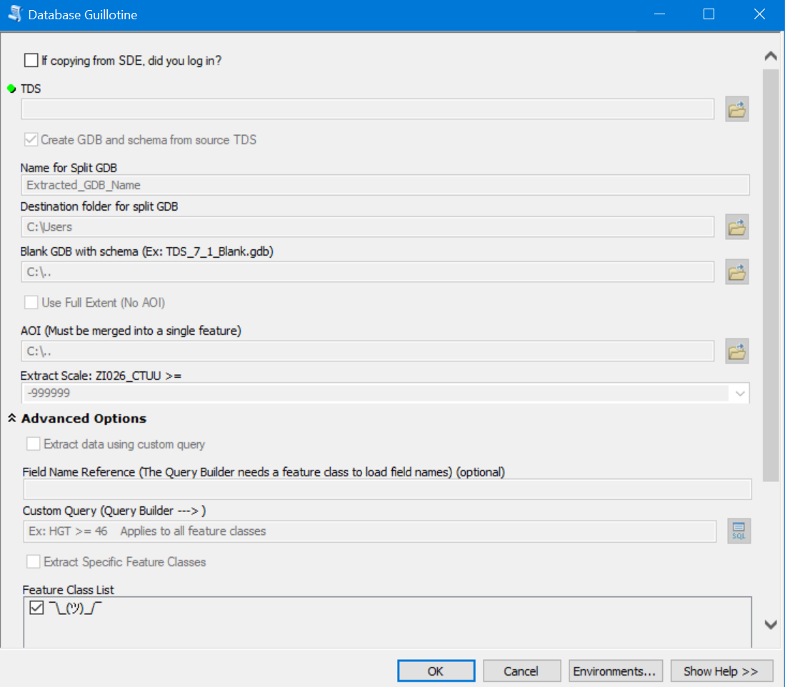

# Database Guillotine

<!--
comment block
-->

<!-- PROJECT SHIELDS -->
<!--
*** I'm using markdown "reference style" links for readability.
*** Reference links are enclosed in brackets [ ] instead of parentheses ( ).
*** See the bottom of this document for the declaration of the reference variables
*** for contributors-url, forks-url, etc. This is an optional, concise syntax you may use.
*** https://www.markdownguide.org/basic-syntax/#reference-style-links
-->
[![Contributors][contributors-shield]][contributors-url]
[![Forks][forks-shield]][forks-url]
[![Stargazers][stars-shield]][stars-url]
[![Issues][issues-shield]][issues-url]
[![MIT License][license-shield]][license-url]
[![LinkedIn][linkedin-shield]][linkedin-url]

<!-- PROJECT LOGO -->
 

  

<h3 align="center">Database Guillotine</h3>

  

    An ArcPy tool that splits a dataset based on an custom queries, AOI polygons, specific feature classes, and more.
     
     
    <a href="https://github.com/github_username/repo_name/issues">Report Bug</a>
    ·
    <a href="https://github.com/github_username/repo_name/issues">Request Feature</a>
  

<!-- TABLE OF CONTENTS -->

  
Table of Contents

  <ol>
    <li>
      <a href="#about-the-project">About The Project</a>
      <ul>
        <li><a href="#built-with">Built With</a></li>
      </ul>
    </li>
    <li>
      <a href="#installation">Installation</a>
      <ul>
        <li><a href="#prerequisites">Prerequisites</a></li>
      </ul>
    </li>
    <li>
      <a href="#roadmap">Roadmap</a>
      <ul>
        <li><a href="#usage">Usage</a></li>
      </ul>
    </li>
    <li>
      <a href="#contact">Contact</a>
      <ul>
        <li><a href="#license">License</a></li>
        <li><a href="#acknowledgments">Acknowledgments</a></li>
      </ul>
    </li>
  </ol>

<!-- ABOUT THE PROJECT -->
## About The Project

[![Toolbox Screen Shot][tool-screenshot]]

Here's a blank template to get started: To avoid retyping too much info.

(<a href="#top">back to top</a>)

### Built With

* [![Python 2.7][Python]][Python-url]

(<a href="#top">back to top</a>)

### Prerequisites

* ArcMap Desktop 10.5+
* Python 2.7

### Installation

1. Download the .tbx ArcGIS Toolbox
2. In ArcMap or ArcCatalog, open the tool box and double click "Database Guillotine"

(<a href="#top">back to top</a>)

<!-- ROADMAP -->
## Roadmap

- [ ] Feature 1
- [ ] Feature 2
- [ ] Feature 3
    - [ ] Nested Feature

(<a href="#top">back to top</a>)

<!-- USAGE EXAMPLES -->
## Usage

Use this space to show useful examples of how a project can be used. Additional screenshots, code examples and demos work well in this space. You may also link to more resources.

(<a href="#top">back to top</a>)

<!-- LICENSE -->
## License

Distributed under the MIT License. See `LICENSE.txt` for more information.

(<a href="#top">back to top</a>)

<!-- CONTACT -->
## Contact

Project Link: [https://github.com/ncagle/Database-Guillotine](github.com/ncagle/Database-Guillotine)

(<a href="#top">back to top</a>)

<!-- ACKNOWLEDGMENTS -->
## Acknowledgments

* J. Jackson [https://github.com/adab5urdum](github.com/adab5urdum)

(<a href="#top">back to top</a>)

<!-- MARKDOWN LINKS & IMAGES -->
<!-- https://www.markdownguide.org/basic-syntax/#reference-style-links -->
[contributors-shield]: https://img.shields.io/github/contributors/ncagle/Database-Guillotine.svg?style=for-the-badge
[contributors-url]: https://github.com/ncagle/Database-Guillotine/graphs/contributors
[forks-shield]: https://img.shields.io/github/forks/ncagle/Database-Guillotine.svg?style=for-the-badge
[forks-url]: https://github.com/ncagle/Database-Guillotine/network/members
[stars-shield]: https://img.shields.io/github/stars/ncagle/Database-Guillotine.svg?style=for-the-badge
[stars-url]: https://github.com/ncagle/Database-Guillotine/stargazers
[issues-shield]: https://img.shields.io/github/issues/ncagle/Database-Guillotine.svg?style=for-the-badge
[issues-url]: https://github.com/ncagle/Database-Guillotine/issues
[license-shield]: https://img.shields.io/github/license/ncagle/Database-Guillotine.svg?style=for-the-badge
[license-url]: https://github.com/ncagle/Database-Guillotine/blob/master/LICENSE.txt
[linkedin-shield]: https://img.shields.io/badge/-LinkedIn-black.svg?style=for-the-badge&logo=linkedin&colorB=555
[linkedin-url]: https://www.linkedin.com/in/ncagle/
[tool-screenshot]: images/toolbox_v1_6.png
[tool-logo]: images/guillotine_small.jpg
[Python]: https://img.shields.io/badge/python-2.7-blue?style=for-the-badge&logo=nextdotjs&logoColor=white
[Python-url]: https://python.org/ 
